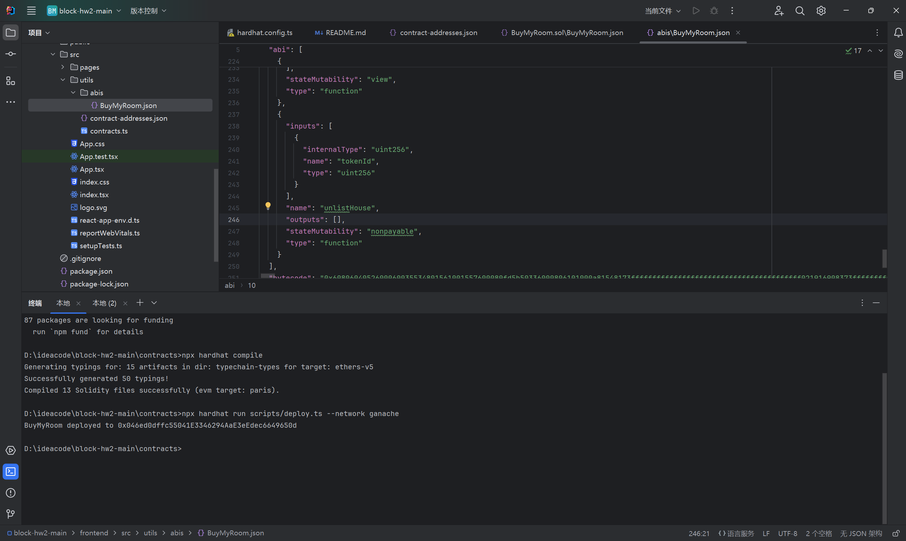
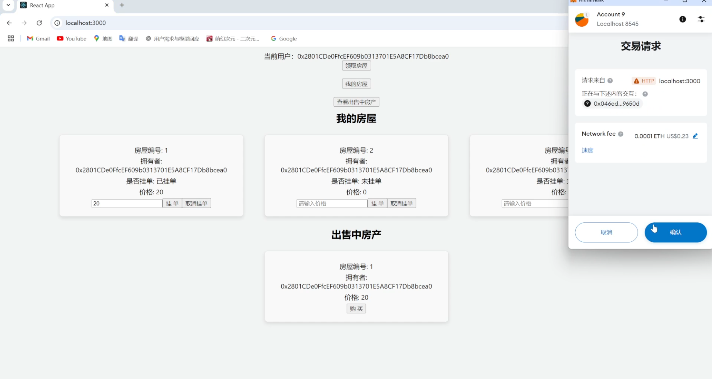

# block-hw2-main

## 如何运行

1. 在本地启动ganache应用。

2. 在 `./contracts` 中安装需要的依赖，运行如下的命令：
    ```bash
    npm install
    ```
3. 在 `./contracts` 中编译合约，运行如下的命令：
    ```bash
    npx hardhat compile
    ```
4. 在ganache中新建以太坊，端口改为8545，将其中一个账户的私钥复制到hardhat.config.ts相应位置中
5. 在 `./contracts` 中部署合约，运行如下的命令：
    ```bash
    npx hardhat run scripts/deploy.ts --network ganache
    ```
6. 在 `./frontend` 中安装需要的依赖，运行如下的命令：
    ```bash
    npm install
    ```
7. 在 `./frontend` 中，把部署地址和ABI复制到相应的位置
8. 在 `./frontend` 中启动前端程序，运行如下的命令：
    ```bash
    npm start
    ```

## 功能实现分析

1. 用户查看自己拥有的房产。并可以设置价格挂单出售自己的房屋。
2. 用户查看所有出售中的房产，并查询房产的各种挂单信息。
3. 用户选择支付房屋价格对应的测试以太币，购买某个其他用户出售的房产。购买后房产拥有权发生变化。
4. 平台收取手续费：在一个房产出售完成时，用户支付的部分测试以太币被转入平台（部署者）。

## 项目运行截图




## 参考内容

- 课程的参考Demo见：[DEMOs](https://github.com/LBruyne/blockchain-course-demos)。

- 快速实现 ERC721 和 ERC20：[模版](https://wizard.openzeppelin.com/#erc20)。记得安装相关依赖 ``"@openzeppelin/contracts": "^5.0.0"``。

- 如何实现ETH和ERC20的兑换？ [参考讲解](https://www.wtf.academy/en/docs/solidity-103/DEX/)

如果有其它参考的内容，也请在这里陈列。
